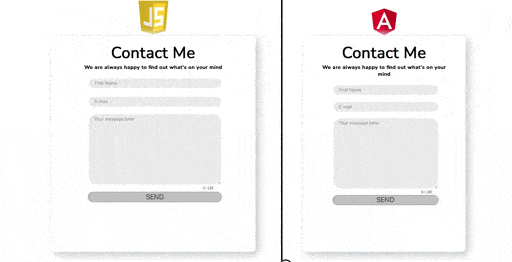
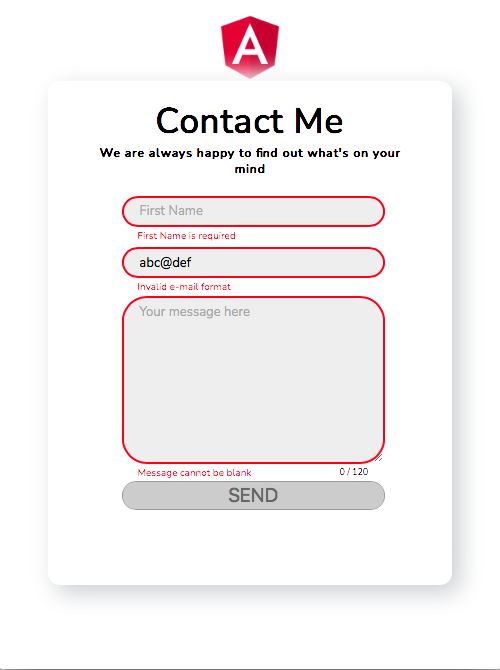
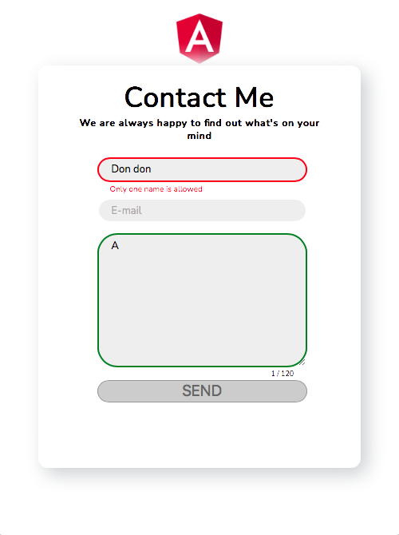
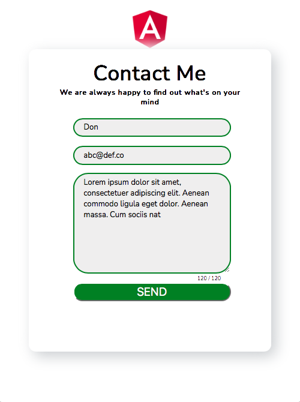

<h1>Validated Contact Form</h1>

 

<h2>TL;DR</h2>

<h3>Criteria</h3>

<ul>
  <li>white based, centred form; intuitive, legible, clear</li>
	<li>three fields with strict validation rules — first name, e-mail, message</li>
  <li>red indication for incorrect entries, send button inactive until all fields correctly filled</li>
  <li>final product to be on the Angular framework</li>
</ul>
<h3>Solution</h3>

<ul>
	<li>resizable, minimalist, intuitive, mobile-first design </li>
  <li>red borders around incorrect or blank fields, with red text directly below</li>
  <li>character count indicator for message box, additional text disabled upon reaching limit</li>
  <li>green borders around valid fields; send button enabled on "all green" status</li>
  <li>page deployment variants: <a href="https://schmwong.github.io/azalea-contact-page/mvp"><b>Vanilla</b></a>  and  <a href="https://schmwong.github.io/azalea-contact-page/angular/"><b>Angular</b></a></li>
</ul>

<table>
  <thead align="center">
    <tr>
      <th>"All Red"</th>
      <th>Partially valid</th>
      <th>"All Green"</th>
    </tr>
  </thead>
  <tr align="center">
    <td></td>
    <td></td>
    <td></td>
  </tr>
</table>

<h2>Main Files Worked On</h2>

<h6>Click on the hyperlinks to view the files and folders.</h6>

<table>
  <thead align="center">
    <tr>
      <th width=50%>Vanilla</th>
      <th width=50%>Angular</th>
    </tr>
  </thead>
  <tbody align="center" valign="top">
    <tr>
    	<td>
        <a href="https://github.com/schmwong/azalea-contact-page/tree/main/docs/mvp">
          
          
<b>./docs/mvp/</b>

        </a>
      </td>
      <td>
        <a href="https://github.com/schmwong/azalea-contact-page/tree/main/angular/src/app">
        	
          
<b>./angular/src/app/</b>

        </a>
      </td>
    </tr>
    <tr>
    	<td>
        <a href="https://github.com/schmwong/azalea-contact-page/blob/main/docs/mvp/index.html">
          <b>index.html</b>
        </a>
	<ul align="left">
          <li>
            Initial foundation upon which the 
            minimum viable product was first built.
          </li>
        </ul>
      </td>
      <td>
        <a href="https://github.com/schmwong/azalea-contact-page/blob/main/angular/src/app/contact-form.component.html">
          <b>contact-form.component.html</b>
        </a>
        <ul align="left">
          <li>Template file of the Component</li>
          <li>Template driven logic:
            <ul>
              <li>input field border colours</li>
              <li>visibility of error text</li>
              <li>"form status" determines disabled attribute of the send button</li>
            </ul>
          </li>
        </ul>
      </td>		
    </tr>
    <tr>
      <td>
        <a href="https://github.com/schmwong/azalea-contact-page/blob/main/docs/mvp/style.css">
          <b>style.css</b>
        </a>
        <ul align="left">
        	<li>The bulk of the styles are in this file, shared with the Angular component</li>
        </ul>
      </td>
      <td>
        <a href="https://github.com/schmwong/azalea-contact-page/blob/main/angular/src/styles.css">
          <b>styles.css</b>
        </a>
        <ul align="left">
          <li>Imports all styles from the vanilla directory</li>
          <li>Smidgen of component specific properties</li>
        </ul>
      </td>
    </tr>
    <tr>
      <td>
        <a href="https://github.com/schmwong/azalea-contact-page/blob/main/docs/mvp/formScript.js">
          <b>formScript.js</b>
        </a>
        <ul align="left">
          <li>File holding all the logic:
          	<ul>
              <li>No external dependencies. Regex instead of validator libraries.</li>
              <li>
                Validator functions that determine input field border colours, error text values and visibility
              </li>
              <li>
                Event Listeners to restrict the Validators to be called on "focus" and "blur" events (when user selects and deselects element), and to update the number indicating the message length as the user types.
              </li>
              <li><code>toggleButton()</code> function determines disabled attribute of send button</li>
            </ul>
          </li>
        </ul>
      </td>
      <td>
        <a href="https://github.com/schmwong/azalea-contact-page/blob/main/angular/src/app/contact-form.component.ts">
          <b>contact-form.component.ts</b>
        </a>
        <ul align="left">
          <li>Reactive logic:
            <ul>
              <li>FormControl elements with built in listeners, updating on "blur" events.</li>
              <li>
                Validator functions, using the same regex, that return the 
                error text to be displayed.
              </li>
              <li>Message length counting method that is bound to the template</li>
              <li>Form submit method that resets input fields and validators</li>
            </ul>
          </li>
        </ul>
      </td>
    </tr>
  </tbody>
</table>

<h2>Automated Deployment</h2>

Live page source files are stored in the  <code>/docs</code>  folder on the <a href="https://github.com/schmwong/azalea-contact-page/tree/gh-pages"><b>gh-pages</b></a> branch.

 It is a lightweight, orphan branch, not <small> (usually) </small> directly committed to.

Custom workflows, triggered upon pushing to specific subdirectories on the main branch, compile or copy the relevant files and push them to the correct folder on the gh-pages branch.
  

<ol>
  <li>
    <h4>For compiling files and deploying  (ng build on GitHub runner)</h4>
    <a href="https://github.com/schmwong/azalea-contact-page/blob/main/.github/workflows/angular-deploy.yml"><b>angular-deploy.yml</b></a> automatically runs upon changes to <code>/angular</code> on the main branch. It uses a third party <a href="https://github.com/marketplace/actions/angular-deploy-gh-pages-actions">action</a> from the GitHub Marketplace to compile the files. However, it merely pushes the compiled files to the root of gh-pages branch. Thus, custom jobs were written to the workflow to move new files to the <code>docs/angular</code> subdirectory and delete the old files.
  </li>
   
  <li>
    <h4>For copying already compiled files to the deployment folder  (ng build on local machine)</h4>
    <a href="https://github.com/schmwong/azalea-contact-page/blob/main/.github/workflows/reusable-copy.yml"><b>reusable-copy.yml</b></a>, a reusable workflow to simply copy <code>/angular</code> and <code>mvp</code> subfolders from <code>/docs</code> on the main branch to the gh-pages branch. It is called by <a href="https://github.com/schmwong/azalea-contact-page/blob/main/.github/workflows/angular-copy.yml"><b>angular-copy.yml</b></a> and <a href="https://github.com/schmwong/azalea-contact-page/blob/main/.github/workflows/vanilla-copy.yml"><b>vanilla-copy.yml</b></a>, which are in turn triggered by changes in the respective subfolders.
  </li>
</ol>

<h2>Further Development</h2>

<ol>
  <li>
    For ease of development and collaboration,
    Angular logic is to be shifted towards a more reactive (model driven) instead of template driven approach.
  </li>
  <li>Observables, subscriptions, RxJS</li>
  <s><li>Automated deployment workflows</li></s>
  <li>Browser automation for form submission testing, to use Python Selenium where feasible</li>
</ol>

